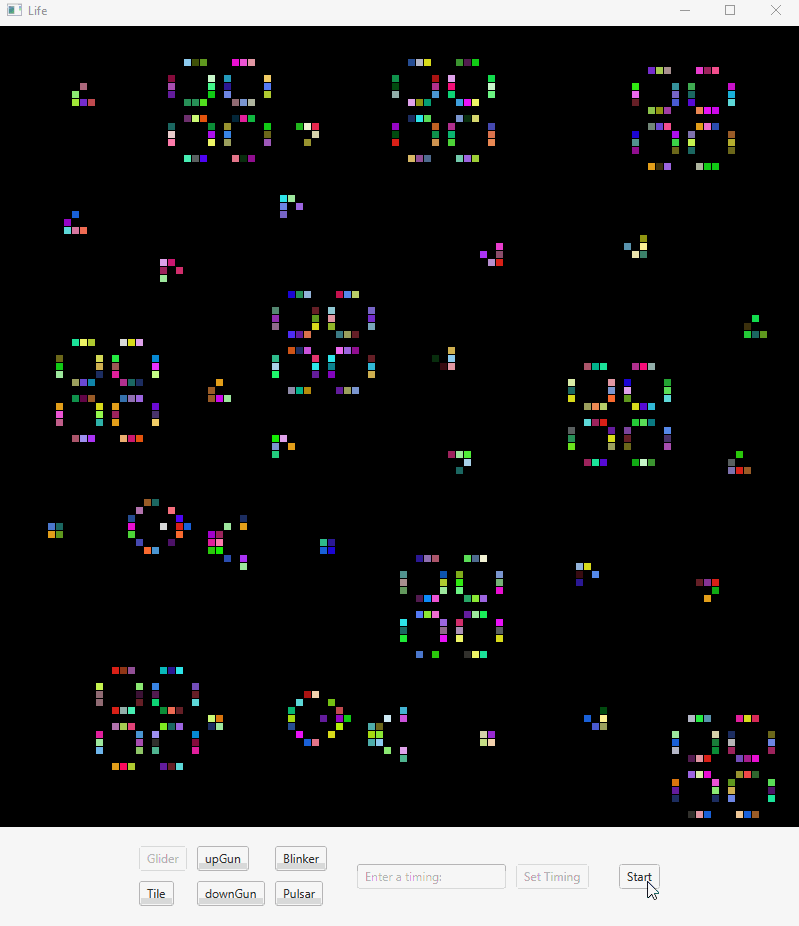

## Life

The game is a zero-player game, meaning that its evolution is determined by its initial state, requiring no further input. One interacts with the Game of Life by creating an initial configuration and observing how it evolves.



## Rules:
* Any live cell with two or three neighbors survives.
* Any dead cell with three live neighbors becomes a live cell.
* All other live cells die in the next generation. Similarly, all other dead cells stay dead.

## Technologies
Project is built using:
* Java 8
* JavaFX
* Maven (https://maven.apache.org/)

## Setup
To run the program, clone this repository and navigate to the Client folder. Once inside, use the Maven compile command to begin.

```
> cd Client
> mvn compile
```

